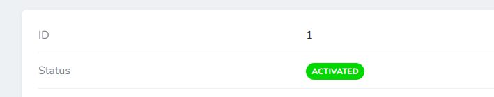
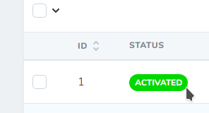

Simple Laravel Nova BelongTo Badge field. It extends the BelongsTo fields and
displays badge on Index and Details page.

## Details page

Example of badge in detail page:



## Index page

Example of badge in index page:



## Installation

Via Composer

``` bash
$ composer require lifeonscreen/nova-belongs-to-badge
```

To create migrations witch adds colors to your tables you can run:

``` bash
$ php artisan make:migration:add-badge-colors {tableName}
```

## Usage

Add this to Field list:
``` php
BelongsToBadge::make('Status', 'status', Status::class),
```

Field will read colors from `badgeBackgroundColor` and `badgeForegroundColor` attribute.

## Security

If you discover any security-related issues, please email the author instead of using the issue tracker.
## Credits 
- [Jani Cerar](https://github.com/janicerar)

## License

MIT license. Please see the [license file](docs/license.md) for more information.

[ico-version]: https://img.shields.io/packagist/v/lifeonscreen/nova-belongs-to-badge.svg?style=flat-square
[ico-downloads]: https://img.shields.io/packagist/dt/lifeonscreen/nova-belongs-to-badge.svg?style=flat-square

[link-packagist]: https://packagist.org/packages/lifeonscreen/nova-belongs-to-badge
[link-downloads]: https://packagist.org/packages/lifeonscreen/nova-belongs-to-badge
[link-author]: https://github.com/LifeOnScreen